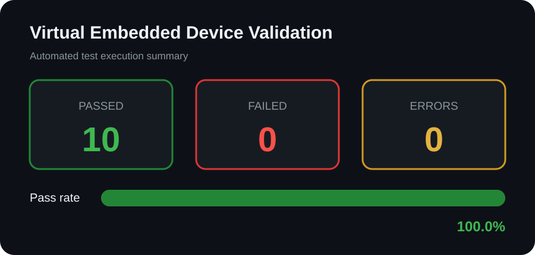

# Virtual Embedded Device Validation Framework


A Python-based automated validation framework for a simulated embedded device.  
The project demonstrates embedded-system testing, fault injection, GPIO
verification, sensor validation, test automation, and report generation without
requiring physical hardware.

> This is a software simulation project. It does not claim testing on physical
> embedded hardware.

## Validation Results



The current automated test run completed with:

- **10 tests passed**
- **0 tests failed**
- **0 execution errors**
- **100% pass rate**

See the complete [validation report](VALIDATION_REPORT.md).

## Features

- Simulated embedded-device command interface
- Communication and device-information checks
- Digital GPIO write and read-back verification
- Invalid GPIO input handling
- Simulated temperature, voltage, and current measurements
- Deterministic sensor behavior for repeatable testing
- Heartbeat counter verification
- Controlled fault injection
- Disconnected-sensor detection
- Overtemperature detection
- Undervoltage detection
- Automated test execution
- CSV test-result generation
- Markdown validation reporting
- SVG test-summary visualization

## System Architecture

```text
+------------------+       Commands        +--------------------------+
| Automated Test   | --------------------> | Virtual Embedded Device  |
| Runner           | <-------------------- | Simulator                |
+------------------+       Responses       +--------------------------+
         |
         | writes
         v
+------------------+       processed by    +--------------------------+
| test_results.csv | --------------------> | Report Generator         |
+------------------+                       +--------------------------+
                                                     |
                                                     v
                                   +----------------------------------+
                                   | SVG Summary and Markdown Report  |
                                   +----------------------------------+
